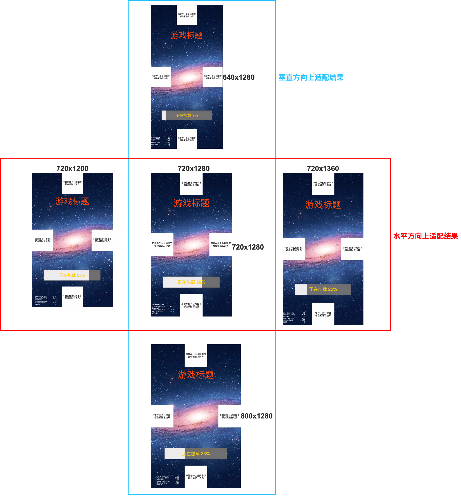

# Cocos Creator 多分辨率完美适配演示项目

## 效果预览

本系列教程指引：

1. [Cocos Creator 多分辨率完美适配系列-1（现状与最终效果）](https://www.jianshu.com/p/c34577e37dd5)
2. [Cocos Creator 多分辨率完美适配系列-2（部署验证设置）](https://www.jianshu.com/p/e30442d38c64)
3. [Cocos Creator 多分辨率完美适配系列-3（背景适配实现）](https://www.jianshu.com/p/24cba3de1e33)
4. [Cocos Creator 多分辨率完美适配系列-4（内容适配实现）](https://www.jianshu.com/p/738a8f6a2ec1)
5. [Cocos Creator 多分辨率完美适配系列-5（贴边栏动画实现）](https://www.jianshu.com/p/e5264904d03f)
6. [Cocos Creator 多分辨率完美适配系列-6（刘海屏适配）](https://www.jianshu.com/p/0fe32dbfe0c9)
7. [Cocos Creator 多分辨率完美适配系列-7（封装库使用）](https://www.jianshu.com/p/de3365853b41)

## 支持一下作者吧

